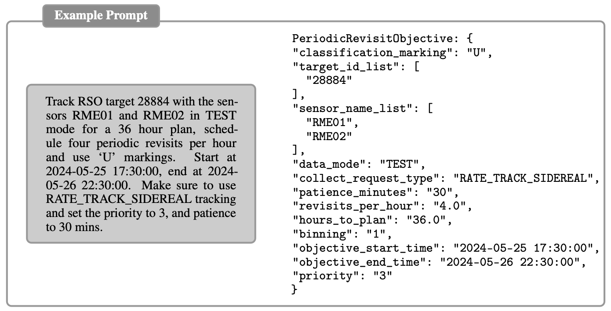

# LLM Server

## Introduction

This is a FastAPI application that leverages Large Language Models (LLMs) to enhance MACHINA.

## Key Features

* FastAPI server for efficient API endpoints
* High-performance LLM serving using vLLM with PagedAttention
* Semantic routing for efficient query dispatching
* Support for various LLMs (Mistral, OpenHermes, Hermes, etc)
* Quantization support (AWQ, GPTQ) for optimized GPU memory usage
* Structured data extraction from LLM outputs using Pydantic

## Prerequisites

* NVIDIA GPU with CUDA support
  * Minimum 6.43 GiB for 4-bit quantized 7B parameter models
  * Minimum 18.2 GiB for 16-bit 7B parameter models
* Docker with NVIDIA Container Toolkit
* Python 3.9+

## Quick Start

1. Clone the repository:

```sh
   git clone git@gitlab.dso-prod.machina.space:kbr-machina-project/machina/miss/llm-server.git
   cd llm-server
```

2. Build the Docker image:

```sh
   docker build -t llm_server .
```

3. Run the Docker container:

```sh
   docker run -v ~/.cache/huggingface:/root/.cache/huggingface --gpus all --name llm -p 8888:8888 llm_server
```

Also:

```sh
   docker run --gpus all -p 8888:8888 -v $HOME/.cache/huggingface:/root/.cache/huggingface llm_server
``` 

Note: Adjust the volume mount path if your Hugging Face cache is located elsewhere.

## Configuration

Key configuration settings are managed in `config.py`. Important settings include:

* `DEFAULT_MODEL`: The LLM to use (e.g., "TheBloke/Mistral-7B-Instruct-v0.2-GPTQ")
* `NUM_GPUS`: Number of GPUs to use
* `MAX_TOKENS`: Maximum number of tokens for generation
* `TEMPERATURE`: Temperature for text generation
* `DEFAULT_GPU_UTIL`: GPU memory utilization (adjust based on your GPU capacity)
* `USE_AGENT`: Enable/disable LLM agent (LLMRouter or MemoryLLM)
* `LLM_AGENT`: Specify the type of LLM agent to use

## API Usage

The server exposes a `/generate` endpoint for text generation:

```sh
curl -X POST http://localhost:8888/generate \
     -H "Content-Type: application/json" \
     -d '{"text": "Track RSO target 28884 with sensors..."}'
```

## Using the Prompt Processor

The `prompt.py` script provides an interactive way to send prompts to the LLM server and process the responses:

1. Ensure the LLM server is running.

2. Run the prompt processor:

```sh
   python prompt.py
```

3. Enter your SDA-related prompts when prompted. Type 'quit' or 'exit' to end the session.


## Structured Data Extraction

LLM Server extracts structured data from LLM outputs. The process involves:

1. Tailored prompting strategies for different LLMs
2. Multi-stage prompting
3. JSON prompt templates for field extraction
4. Pydantic schemas for data validation and integrity

### Example Prompt and LLM Output



This shows the structured data extraction process, showing an example prompt and the corresponding JSON output extracted by the LLM.

## Supported Models

LLM Chat has been tested with the following models:

* Mistral 7B Instruct v0.2
* OpenHermes 2.5 Mistral 7B
* Hermes 2 Pro Mistral-7B

For this task, Mistral-7B-Instruct-v0.2-GPTQ has the best performance.

## Quantization

LLM Chat supports two quantization methods:

* Activation-aware Weight Quantization (AWQ)
* Generative Pre-trained Transformer Quantization (GPTQ)

Our experiments have shown that GPTQ offers faster inference speeds over AWQ while maintaining similar performance on tested models.

## Performance Considerations

* GPU performance varies based on the model and quantization method used.
* 4-bit quantized models (AWQ, GPTQ) generally offer better performance and lower memory usage compared to 16-bit models.
* Adjust `DEFAULT_GPU_UTIL` in `config.py` based on your GPU's capacity and the model's requirements.
